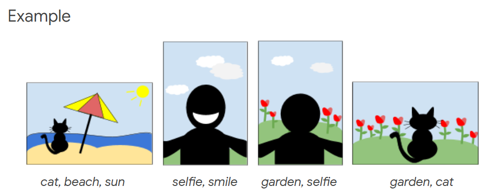

# Google-Photoslide-Challenge

> Task: Given a list of photos and the tags associated with each photo, arrange the photos into a slideshow that is as interesting as possible

1. Data is stored in a dictionary (key: tag-count of slide, value: ID of slide) for fast retrieval
2. Take two slides with high tag-count/score as head and tail of the slideshow
3. Carry out the following while the slideshow is not completed:
   1. Loop through dictionary from highest to lowest tag-counts
   2. Compute transition score of slides relative to the head and tail slide
   3. Keep track of optimal slides (slides that yield the maximum scores) for each ends
   4. Break the loop when (tag-count > 2 x maximum score) because theretically, it is impossible for slides with equal or lower tag-counts to break the maximum score record
   5. Append optimal slides to head and tail of slideshow
   6. Remove the slide IDs from the dictionary
  
Duration: 4 hours 40 minutes 
Score: 409,226
